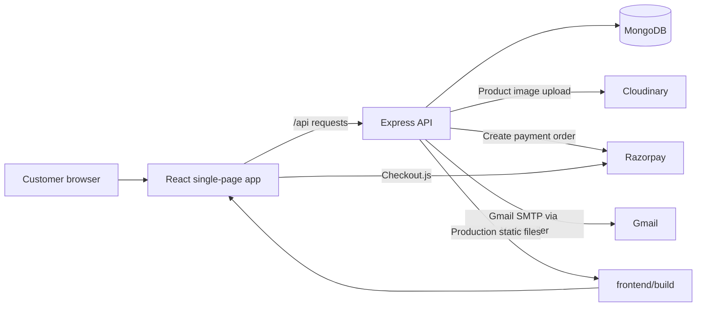

# ShopNest

A full-stack e-commerce demo with a React storefront, an Express API, MongoDB persistence, and integrations for product images, email, and Razorpay checkout.

[](https://shopnest-ecom-mern-jcdt.onrender.com/)


**Live Demo:** [https://shopnest-ecom-mern-jcdt.onrender.com/](https://shopnest-ecom-mern-jcdt.onrender.com/)

## Overview

ShopNest is a portfolio-oriented online store for browsing a product catalogue, managing a browser-persisted cart, placing orders, and administering products and order statuses. The React client talks to an Express API backed by MongoDB; the backend also connects to Cloudinary, Razorpay, and Gmail SMTP for configured workflows.

## Key Features

### Authentication and authorization

- Register and log in with email and password.
- Passwords are hashed with `bcryptjs`; successful authentication returns a JWT with a 30-day expiry.
- Admin-only API operations are guarded by JWT authentication and an `admin` role check.
- The client stores user data and the JWT in `localStorage`.

### Catalogue and shopping

- Browse product listings and details; filter the loaded catalogue by product name in the client.
- Add products to a cart, update quantities, remove items, and persist cart state in `localStorage` through Redux Toolkit.
- Submit a shipping address and view the signed-in user's order history.

### Administration

- Create, edit, and delete products.
- Upload product images through Multer and Cloudinary.
- View users and orders, update order status, and view aggregate order, product, user, and stored-order-total figures.

### Payments and email

- Create Razorpay orders and expose a server endpoint that checks a Razorpay signature.
- Send a registration welcome email containing a generated OTP-like value and send order-confirmation email through Gmail SMTP when configured.

These integrations are present in the code, but the payment and OTP flows have limitations described in [Security Notes](#security-notes). They should not be treated as production-ready commerce or identity verification.

## Tech Stack

| Area | Implementation |
| --- | --- |
| Frontend | React 18, Create React App (`react-scripts`), React Router 6 |
| Client state | Redux Toolkit, React Redux, React Context |
| Backend | Node.js 22, Express 5 |
| Database | MongoDB with Mongoose |
| Authentication | `jsonwebtoken`, `bcryptjs` |
| Image uploads | Multer and Cloudinary SDK |
| Payments | Razorpay Node SDK and Razorpay Checkout script |
| Email | Nodemailer using the Gmail service |
| Local development | `concurrently`, CRA development proxy |
| Hosting | Render Web Service; Express serves the built React app in production |

## System Architecture



During local development, Create React App proxies `/api` requests to `http://localhost:5000`. In production, the Express process serves `frontend/build` and the API from the same Render service and origin. MongoDB is accessed through Mongoose. Multer stages uploaded files under `backend/uploads/` before the Cloudinary upload call.

## Application Flow

1. The storefront requests the public product list from `GET /api/products`; product detail pages request an individual product.
2. Cart items are held by the Redux store and persisted in browser `localStorage`.
3. Registration or login calls the auth API. The response contains a signed JWT, which the client stores with the user data and sends on protected requests as `Authorization: Bearer <token>`.
4. At checkout, the client requests a Razorpay order using its calculated cart total, opens Razorpay Checkout, and then calls the backend signature endpoint.
5. If the client proceeds, it submits order items, prices, total, address, and payment ID to the protected order endpoint. The API stores the submitted values in MongoDB and attempts to send an order email.
6. Admin screens use protected endpoints to manage products and orders and to load dashboard aggregates.

The checkout behavior in steps 4–5 is demonstrative. See the payment and order limitations below before using this application with real transactions.

## Project Structure

```text
.
├── backend/
│   ├── config/          # MongoDB and Cloudinary setup
│   ├── controllers/     # Route handlers
│   ├── middleware/      # JWT and admin authorization
│   ├── model/           # Mongoose schemas
│   ├── routes/          # Express API routes
│   ├── utils/           # Email helper
│   ├── seed.js           # Development seed script
│   └── server.js         # API entry point and production static hosting
├── frontend/
│   ├── public/           # CRA HTML shell and static assets
│   └── src/
│       ├── admin/        # Admin dashboard and management screens
│       ├── components/   # Shared UI components
│       ├── context/      # Authentication state
│       ├── pages/        # Store, account, checkout, and policy pages
│       ├── redux/        # Cart slice and Redux store
│       └── styles/       # CSS stylesheets
├── ShopNest_Postman_Collection.json
├── package.json          # Root scripts
└── README.md
```

Lockfiles are kept alongside the root, backend, and frontend package manifests. Dependency directories, build output, and environment files are intentionally omitted from this overview.

## API Overview

All routes are mounted under `/api`. “Admin” means a valid Bearer JWT whose user has `role: "admin"`; “User” means a valid Bearer JWT.

### Authentication

| Method | Endpoint | Purpose | Access |
| --- | --- | --- | --- |
| `POST` | `/api/auth/register` | Create an account, send the welcome email, and return a JWT | Public |
| `POST` | `/api/auth/login` | Authenticate with email and password; return a JWT | Public |
| `GET` | `/api/auth/users` | List users without their password field | Admin |

### Products

| Method | Endpoint | Purpose | Access |
| --- | --- | --- | --- |
| `GET` | `/api/products` | List products | Public |
| `POST` | `/api/products` | Create a product; accepts an `image` multipart file | Admin |
| `GET` | `/api/products/:id` | Get one product | Public |
| `PUT` | `/api/products/:id` | Update product fields; accepts an optional `image` multipart file | Admin |
| `DELETE` | `/api/products/:id` | Delete a product | Admin |

### Orders

| Method | Endpoint | Purpose | Access |
| --- | --- | --- | --- |
| `POST` | `/api/orders` | Save an order from submitted items, amount, address, and payment ID | User |
| `GET` | `/api/orders/myorders` | List the signed-in user's orders | User |
| `GET` | `/api/orders` | List all orders, with the associated user populated | Admin |
| `PUT` | `/api/orders/:id/status` | Update an order's status | Admin |

### Payments and analytics

| Method | Endpoint | Purpose | Access |
| --- | --- | --- | --- |
| `POST` | `/api/payment/order` | Create a Razorpay order using the submitted amount | Public |
| `POST` | `/api/payment/verify` | Check the submitted Razorpay signature | Public |
| `GET` | `/api/analytics` | Return order, product, user, and stored-order-total aggregates | Admin |

The payment endpoints are currently public and are not bound to a server-created application order. Do not interpret a successful signature response as a complete or production-safe order verification workflow.

## Database Models

All schemas use Mongoose timestamps (`createdAt` and `updatedAt`).

| Model | Fields and relationships |
| --- | --- |
| `User` | `name`, unique `email`, `password`, and `role` (`user` or `admin`, default `user`). |
| `Product` | `name`, `description`, `price`, `category`, `stock`, `imageUrl`, `ratings` (default `0`), and `numReviews` (default `0`). |
| `Order` | `userId` references `User`; each `items` entry has `productId` referencing `Product`, `qty`, and `price`; also `totalAmount`, shipping `address` (`fullName`, `street`, `city`, `postalCode`, `country`), optional `paymentId`, and `status` (`Pending`, `Shipped`, or `Delivered`, default `Pending`). |
| `Review` | `productId` references `Product`; `userId` references `User`; also `name`, `rating` (1–5), and `comment`. A review schema exists, but no review API route is currently registered. |

## Authentication and Authorization

Registration hashes passwords with `bcryptjs`; login compares the submitted password against the stored hash. The API signs a JWT containing the user ID with `JWT_SECRET` and a 30-day expiration. Protected routes verify the Bearer token and load the user; admin routes additionally require the user's role to be `admin`.

The React `AuthContext` persists the returned user object, including its token, in `localStorage`. The server-side middleware is the access-control boundary; client-side navigation checks are not a substitute for API authorization.

## Payments

The backend uses the Razorpay SDK to create an order from an amount supplied in the request and computes an HMAC signature check using `RAZORPAY_KEY_SECRET`. The browser loads Razorpay Checkout.js. The checkout page also contains a placeholder test key and offers a bypass path when order initialization fails.

This is demo/test payment code, not a production payment implementation. In particular, order creation trusts a client-supplied amount, order persistence trusts client-supplied prices and totals, the order API does not require a verified payment, and the bypass can create an order without payment. The signature endpoint does not itself associate the verified payment with a persisted application order. Do not use live payment credentials or rely on stored totals as verified revenue.

## Environment Variables

Create `backend/.env` from `backend/.env.example`. The example file contains placeholders only; replace them locally and keep the resulting `.env` private.

| Variable | Purpose | Required when |
| --- | --- | --- |
| `PORT` | HTTP listen port; defaults to `5000` locally | Optional locally; hosting platform supplies it |
| `NODE_ENV` | Enables production static-file hosting when set to `production` | Required for Render production behavior |
| `MONGO_URI` | Mongoose connection string | Always |
| `JWT_SECRET` | Signs and verifies authentication tokens | Always |
| `FRONTEND_URL` | Additional allowed origin in the CORS configuration | When the frontend is served from a separate origin |
| `CLOUDINARY_CLOUD_NAME` | Cloudinary account name | Product image uploads |
| `CLOUDINARY_API_KEY` | Cloudinary API key | Product image uploads |
| `CLOUDINARY_API_SECRET` | Cloudinary API secret | Product image uploads |
| `RAZORPAY_KEY_ID` | Razorpay SDK key ID | Razorpay order creation |
| `RAZORPAY_KEY_SECRET` | Razorpay SDK secret and signature-check key | Razorpay order creation/signature check |
| `GMAIL_USER` | Gmail SMTP account used by Nodemailer | Sending email |
| `GMAIL_PASS` | Gmail app password used by Nodemailer | Sending email |

Never paste real environment values into source code, issues, screenshots, or documentation. Rotate credentials immediately if they are exposed.

## Local Development Setup

### Prerequisites

- Node.js 22.x and npm
- A MongoDB instance, local or hosted
- Optional credentials for Cloudinary, Razorpay, and Gmail-backed email

### Install and run

1. Clone the repository:

   ```bash
   git clone <repository-url>
   cd shopnest-ecom-MERN
   ```

2. Create the backend environment file. On macOS/Linux:

   ```bash
   cp backend/.env.example backend/.env
   ```

   In PowerShell:

   ```powershell
   Copy-Item backend/.env.example backend/.env
   ```

   Set `MONGO_URI` to your database and replace `JWT_SECRET` with a private random value. For example, generate one with:

   ```bash
   node -e "console.log(require('crypto').randomBytes(32).toString('hex'))"
   ```

   Configure the optional service variables only when using those integrations.

3. From the repository root, install dependencies:

   ```bash
   npm run install:all
   ```

4. Start the backend and frontend together:

   ```bash
   npm run dev
   ```

5. Open [http://localhost:3000](http://localhost:3000). The API listens on port `5000`; the CRA proxy forwards frontend `/api` requests to it.

6. To load the sample catalogue and admin user into an isolated development database, see [Database Seeding](#database-seeding).

## Available Scripts

Run root scripts from the repository root.

| Command | Description |
| --- | --- |
| `npm run install:all` | Install root tools, install backend dependencies from its lockfile, then install frontend dependencies. |
| `npm run dev` | Run backend `dev` and frontend `start` concurrently. |
| `npm run build` | Run the Render production build script. |
| `npm run render-build` | Install backend/frontend dependencies and build the React app into `frontend/build`. |
| `npm start` | Start the backend, which serves the frontend build when `NODE_ENV=production`. |
| `npm run seed` | Run the backend sample-data script. Destructive to existing users and products. |

Package-specific commands are also available: `npm --prefix backend start`, `npm --prefix backend run dev`, `npm --prefix backend run seed`, `npm --prefix frontend start`, and `npm --prefix frontend run build`. No automated test script is currently defined in the package manifests.

## Database Seeding

Run `npm run seed` from the repository root after configuring `backend/.env` and ensuring MongoDB is reachable. The script deletes **all existing users and products**, then inserts an admin user and four sample products. It does not clear existing orders. The seeded admin uses a password hard-coded in the seed source; do not rely on that account outside an isolated test database, and never seed a database containing data you need to preserve.

## Deployment

### Live demo

[https://shopnest-ecom-mern-jcdt.onrender.com/](https://shopnest-ecom-mern-jcdt.onrender.com/)

### Render Web Service

The repository has no `render.yaml`; configure the service in the Render dashboard:

| Setting | Value |
| --- | --- |
| Service type | Web Service |
| Root directory | Repository root (leave blank) |
| Build command | `npm run render-build` |
| Start command | `npm start` |
| Node version | `22.x` (declared in the root package manifest) |

Set these environment variables in Render:

- `NODE_ENV=production`
- `MONGO_URI` pointing to a MongoDB Atlas database
- `JWT_SECRET` set to a private random secret
- `PORT` is provided by Render; the server reads `process.env.PORT`

Configure Atlas network access and database-user permissions for the Render service. Add Cloudinary, Razorpay, and Gmail variables only for the corresponding features. The build generates `frontend/build`; the backend serves that directory and the API from the same service. This deployment setup does not make the current payment flow production-safe; see [Payments](#payments) and [Security Notes](#security-notes).

## Screenshots and Demo

The live demo is available at [shopnest-ecom-mern-jcdt.onrender.com](https://shopnest-ecom-mern-jcdt.onrender.com/). Screenshots are not currently included in the repository.

The repository also includes [`ShopNest_Postman_Collection.json`](ShopNest_Postman_Collection.json) for importing the API requests into Postman.

## Security Notes

- Keep `backend/.env` out of version control and protect all database, JWT, Cloudinary, Razorpay, and Gmail credentials. Rotate any credential that has been exposed.
- Passwords are hashed, and protected API routes use JWT verification; admin operations additionally check the account role.
- JWTs are stored in browser `localStorage`, so an XSS vulnerability in the client could expose a token. Consider an HTTP-only cookie design and appropriate CSRF protections before production use.
- Registration generates and emails an OTP-like value, but the value is neither persisted nor validated; registration returns a JWT immediately. It is not email verification.
- Payment creation and verification routes are public. The order endpoint accepts submitted totals, item prices, and payment IDs without independently verifying payment or recomputing prices/stock. Checkout also includes a test bypass and a placeholder Razorpay key.
- Admin analytics sum stored order totals without checking whether payment was settled. Treat these figures as application data, not verified financial reporting.
- The seed script includes a hard-coded demo admin password. Keep seeding restricted to an isolated development/test database.

Do not use this implementation to process real payments or store live customer order data until the payment, order-validation, and account-verification flows have been hardened and reviewed.

## Known Limitations and Future Improvements

The following are follow-up opportunities, not currently implemented features:

- Bind each payment to a server-created order, validate Razorpay webhook/signature state server-side, and remove the client-side bypass.
- Recalculate prices and validate product existence, stock, quantities, and totals on the server before persisting an order.
- Implement persisted OTP verification and account recovery flows.
- Add request validation, rate limiting, automated tests, and operational logging/health checks.
- Add review endpoints and client workflows for the existing `Review` schema.
- Reconcile image-upload temporary-file handling and clean up staged uploads after transfer.

## Contributing

1. Fork the repository and create a focused feature or fix branch.
2. Make changes consistent with the existing frontend/backend structure; do not commit `.env` files or generated dependencies/build output.
3. Run `npm run build` and, when relevant, exercise the changed API routes with the included Postman collection.
4. Open a pull request describing the change, configuration needs, and how it was verified.

## License

There is no root-level `LICENSE` file. The backend package metadata declares `ISC`; confirm the intended project-wide license before reusing or distributing the repository.

## Author

Goutam Khandelwal
